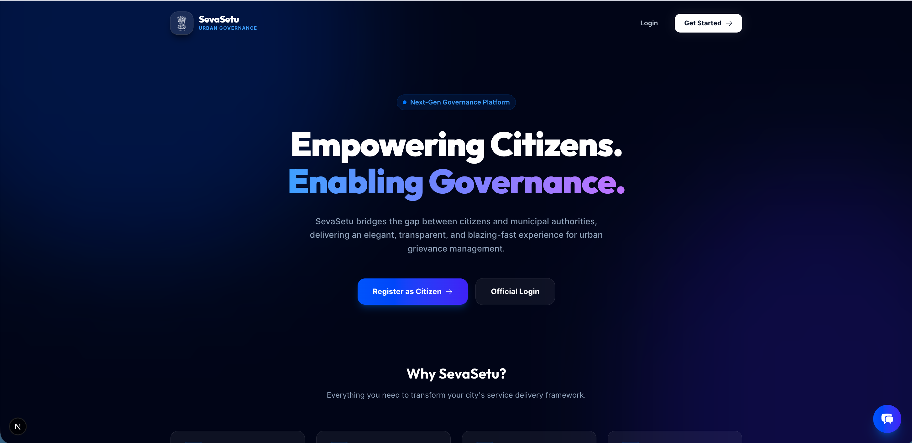
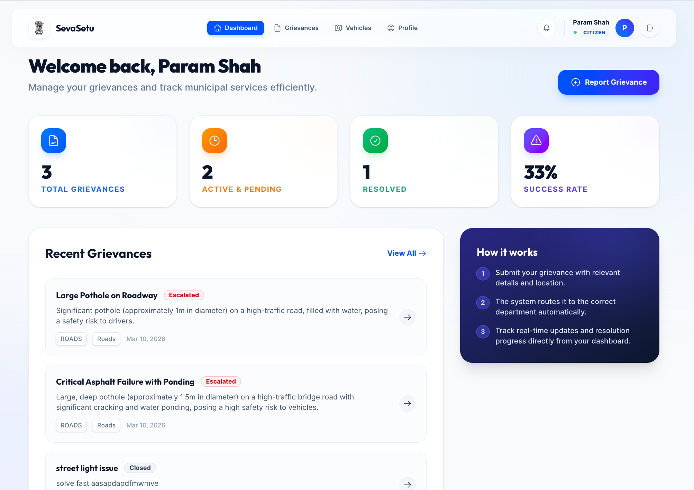
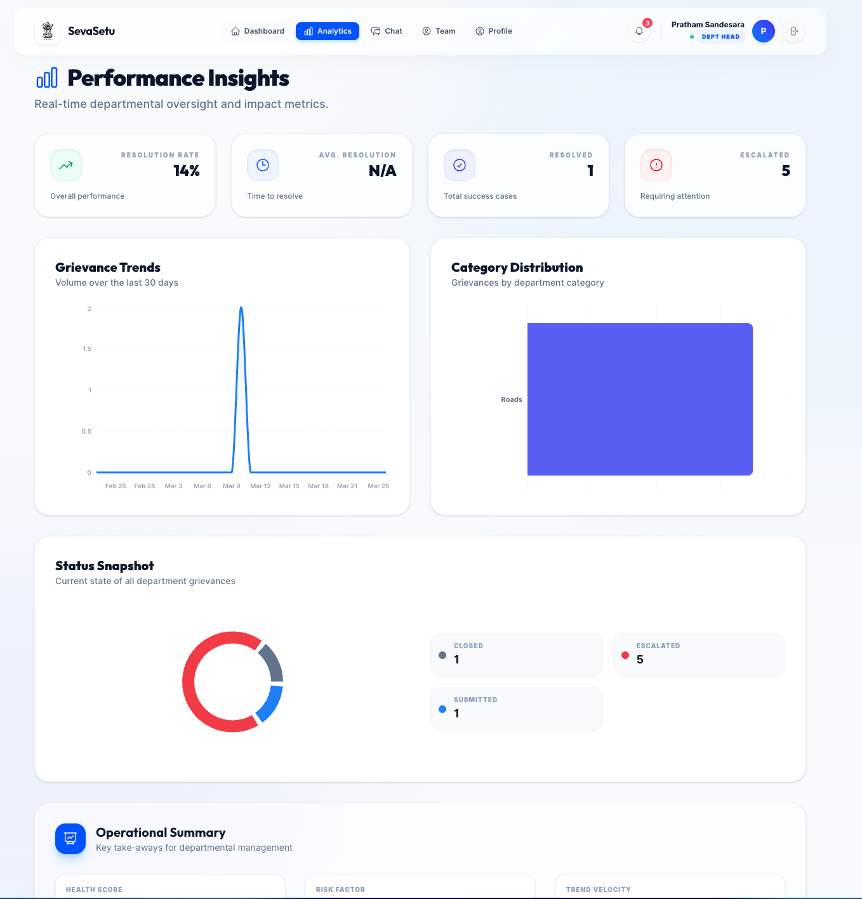
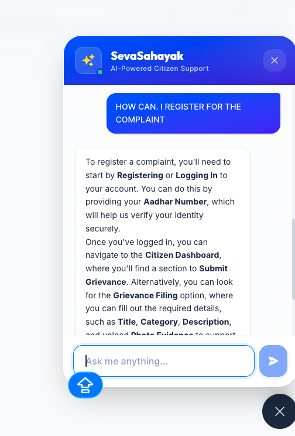
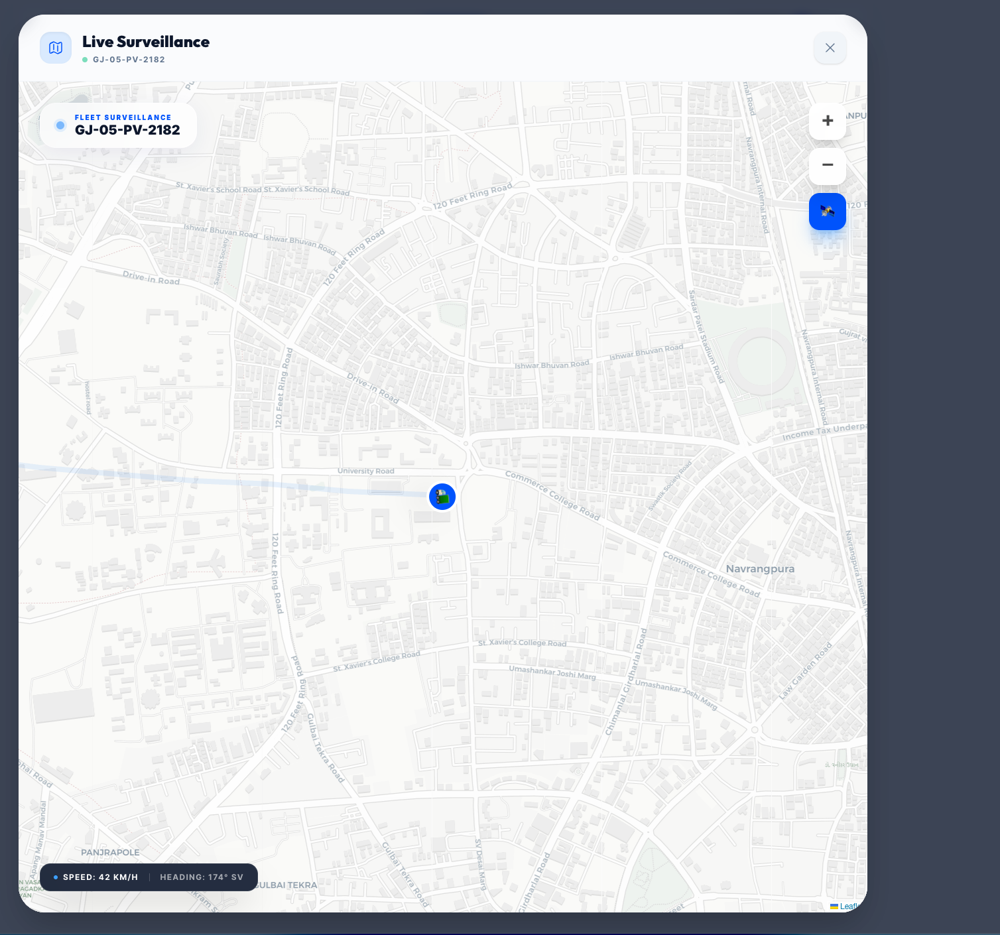
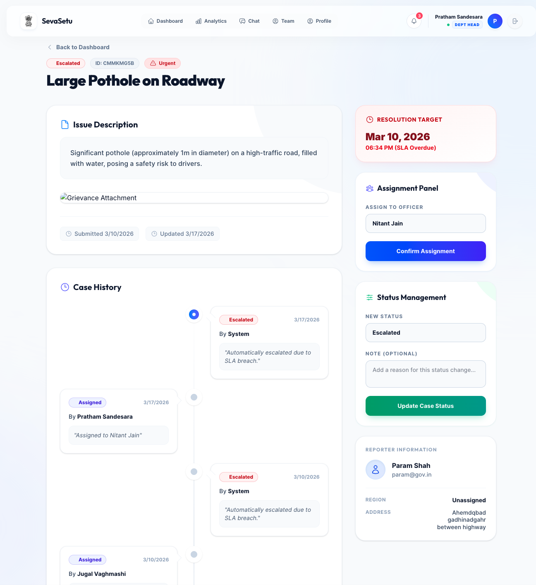
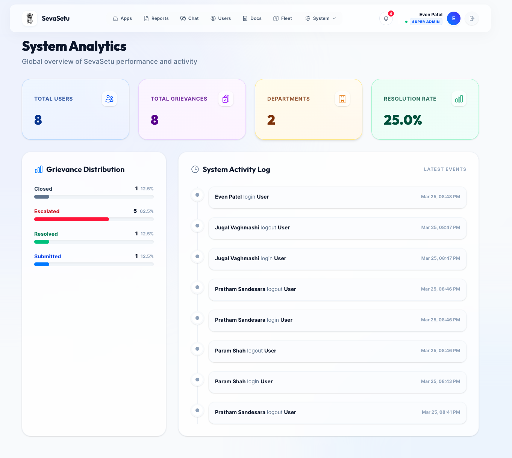

# 🏗️ SevaSetu: The Future of Urban Governance

[](https://nextjs.org/)
[](https://www.typescriptlang.org/)
[](https://www.prisma.io/)
[](https://tailwindcss.com/)
[](https://opensource.org/licenses/MIT)

**SevaSetu** is a premium, high-performance urban governance platform designed to bridge the gap between citizens and municipal authorities. It provides a seamless, transparent, and efficient way to manage grievances, track public services, and ensure accountable governance through a modern, glassmorphic interface.

---

## 🌟 Vision

Our mission is to empower citizens and digitize municipal workflows with state-of-the-art technology, ensuring every grievance is heard, tracked, and resolved with absolute transparency.

---

## ✨ System Capabilities

### 👥 For Citizens
- **🚀 One-Tap Grievance Filing**: Submit issues with automated location tagging, high-quality image uploads, and category selection.
- **📍 Live Tracking Grid**: A specialized "Recent Assignments" and "History" view to monitor progress with a visual timeline.
- **🤖 AI Seva-Sahayak**: An intelligent chatbot that helps users navigate the platform, check grievance status, and provides helpful governance information.
- **📱 Mobile Ready**: Seamless experience on Android and iOS via Capacitor integration.

### 👮 For Field Officers
- **📋 Management Dashboard**: Dedicated workspace to view assigned cases, update progress, and add resolution remarks.
- **🗺️ Interactive Map**: Real-time visualization of grievance locations for better route planning and resource allocation.
- **📸 Evidence Submission**: Upload resolution proofs directly from the field.

### 📊 For Department Heads
- **📈 Advanced Analytics**: Real-time performance monitoring with interactive charts (Trends, Status Distribution, Category breakdown).
- **⏱️ Efficiency Metrics**: Track average resolution times and SLA compliance across your entire department.
- **🔄 Departmental Oversight**: Effortlessly manage officer assignments and regional responsibilities.

### ⚙️ For Administrators
- **🔑 RBAC Control**: Granular Role-Based Access Control to manage users and staff.
- **🛠️ Service Settings**: Configure departments, regions, and system-wide SLA rules.
- **🚨 Maintenance Mode**: Instantly toggle maintenance mode with real-time redirection for all active users.

---

## 🚀 Advanced Features

- **🛡️ Glassmorphism UI**: A premium, modern design language using translucent layers and vibrant gradients.
- **⚡ Real-time Watchers**: Maintenance mode and status updates happen instantly across the app without page refreshes.
- **🧠 Intelligent Search**: Powerful filtering and search capabilities across all modules.
- **🌘 Theme-Aware Iconography**: Favicons and UI elements that adapt to your system's light/dark mode preference.

---

## 💻 Tech Stack

- **Framework**: [Next.js 15](https://nextjs.org/) (App Router, Server Actions)
- **Styling**: [Tailwind CSS v4](https://tailwindcss.com/) with custom glassmorphism utilities
- **Database**: PostgreSQL / SQLite with [Prisma ORM](https://www.prisma.io/)
- **Charts**: [Recharts](https://recharts.org/) for high-fidelity data visualization
- **Mobile**: [Capacitor 8](https://capacitorjs.com/) for native Android/iOS builds
- **AI**: Google Gemini Pro integration for the Seva-Sahayak Chatbot
- **Auth**: JWT-based secure session management with HTTP-only cookies

---

## 🛠️ Installation & Setup

### Prerequisites
- **Node.js**: v18+ 
- **npm**: v9+

### Quick Start

1. **Clone & Install**
   ```bash
   git clone https://github.com/jugal-ahir/SevaSetu.git
   cd sevasetu
   npm install
   ```

2. **Configuration**
   Create a `.env` file:
   ```env
   DATABASE_URL="file:./dev.db"
   JWT_SECRET="your-super-secret-key"
   GEMINI_API_KEY="your-google-gemini-key"
   ```

3. **Database Setup**
   ```bash
   npx prisma db push
   npx prisma generate
   ```

4. **Launch**
   ```bash
   npm run dev
   ```

Open [http://localhost:3000](http://localhost:3000) to experience the platform.

## 📸 Project Screenshots

<div align="center">
  
  <p><i>The premium, glassmorphic landing page designed for a modern governance experience.</i></p>
  
  <br/>
  
  
  <p><i>The central command center for field officers and administrators.</i></p>
  
  <br/>
  
  
  <p><i>Deep insights and performance metrics for department heads.</i></p>
  
  <br/>
  
  
  <p><i>AI-powered assistance for citizen queries and grievance tracking.</i></p>
  
  <br/>
  
  
  <p><i>Real-time surveillance and field officer tracking on a specialized map.</i></p>
  
  <br/>
  
  
  <p><i>Visual tracking of grievance progress from submission to resolution.</i></p>
  
  <br/>
  
  
  <p><i>Detailed system logs and activity tracking for administrators.</i></p>
</div>

---

## 📁 Architecture

```text
sevasetu/
├── src/
│   ├── app/                # App Router (Pages, Layouts, API Endpoints)
│   ├── components/         # Reusable Premium UI Components
│   ├── lib/                # Shared logic (Auth, Prisma, Utils)
│   ├── hooks/              # Custom React hooks for global states
│   └── styles/             # Global CSS & Tailwind configuration
├── prisma/                 # Type-safe Database Schema
├── android/                # Native Android Project Files
└── public/                 # Optimized Assets & Icons
```

---

## 🤝 Contributing

Join us in building the future of governance! 
1. Fork the Project
2. Create your Feature Branch (`git checkout -b feature/AmazingFeature`)
3. Commit your Changes (`git commit -m 'Add some AmazingFeature'`)
4. Push to the Branch (`git push origin feature/AmazingFeature`)
5. Open a Pull Request

---

## ⚖️ License

Distributed under the MIT License. See `LICENSE` for more information.

---

<p align="center">
  <b>Built with ❤️ by the SevaSetu Team</b><br/>
  <i>Empowering Governance through Innovation.</i>
</p>
